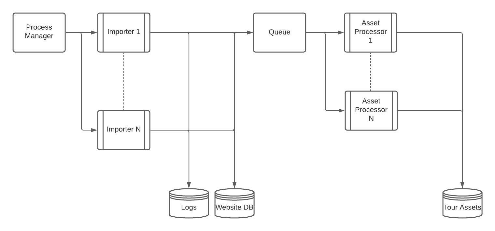

    Importers are CLI scripts (written in a high level language) that:
    * Download files (json, xml, ...) from operator APIs
    * Transform them into our own JSON format
    * Write this transformed JSON as a Tour file to storage ...while also doing logging to help debug issues later.

    A Tour Processor keeps polling Queue for new messages. For each message it:
    * pulls relevant Tour file from Tour files storage
    * pulls Tour assets, such as images, pdfs, etc as indicated by the Tour file JSON schema, post-processes them (e.g. create variations of image sizes) and writes them to Tour Assets storage
    * writes JSON data to the main Website DB

Problems with this setup:

* importers and processors rely on network connections and filesystem to send/recieve data, filesystem operations are expensive, it would be better to use some fast storage like redis
* redundant data flow, we don't really need to send the parsed API response over the network to insert it into database, the expensive part is downloading the data, processing and inserting it is relatively cheap and can be done in the same place
* tour asset processing should be done asynchronously

My solution would be to simplify this by getting rid of the intermediary process between parsing API response and inserting it into the website DB.

The process manager should spawn a script that reads the API, inserts it into DB and delegates the asset handling to a different process.

The advantage of this is limiting data flow over network which is expensive and can be a bottleneck. We're also getting rid of unnecessary storage which means less things to maintain. Less steps in the process means it's easier to understand and maintain.

What is missing: functional and unit tests, I would use something like Behat to test this whole app with test DB and mocked APIs. 
